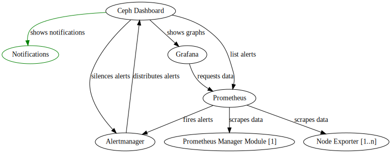
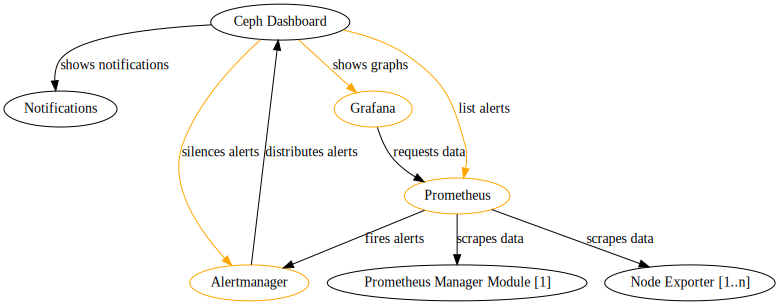
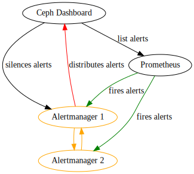
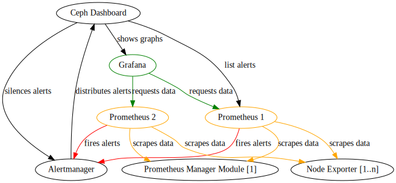

<!-- .slide: data-state="normal" id="architecture1" data-timing="20s" data-menu-title="Standard text slide" -->

## Overview

Architecture

---

<!-- .slide: data-state="normal" id="architecture2" data-timing="20s" data-menu-title="Standard text slide" -->

## Manage Monitoring Stack with Ceph Dashboard

Architecture

---

<!-- .slide: data-state="normal" id="architecture2" data-timing="20s" data-menu-title="Standard text slide" -->

## High Available Alertmanager

Architecture

---

<!-- .slide: data-state="normal" id="architecture2" data-timing="20s" data-menu-title="Standard text slide" -->

## High Available Prometheus

Architecture

