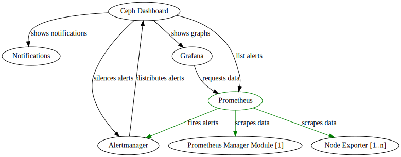

<!-- .slide: data-state="normal" id="architecture-overview-1" data-timing="20s" data-menu-title="Standard text slide" -->

## Overview

Architecture

--

<!-- .slide: data-state="normal" id="architecture-overview-2" data-timing="20s" data-menu-title="Standard text slide" -->

## Manage Monitoring Stack with Ceph Dashboard

Architecture

--

<!-- .slide: data-state="normal" id="architecture-overview-3" data-timing="20s" data-menu-title="Standard text slide" -->

## Prometheus

Architecture

--

<!-- .slide: data-state="normal" id="architecture-overview-4" data-timing="20s" data-menu-title="Standard text slide" -->

## High Available Alertmanager

Architecture

--

<!-- .slide: data-state="normal" id="architecture-overview-5" data-timing="20s" data-menu-title="Standard text slide" -->

## High Available Prometheus

Architecture

