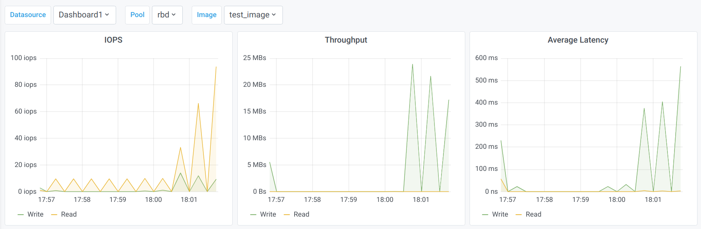

<!-- .slide: data-state="normal" id="features" data-timing="20s" data-menu-title="Standard text slide" -->

## Feature Overview

New Features

- Auto Configuration of all Components
- Fully Containerized
- Per RBD Graphs

--

<!-- .slide: data-state="normal" id="features" data-timing="20s" data-menu-title="Standard text slide" -->

## Per RBD Graphs

Architecture

